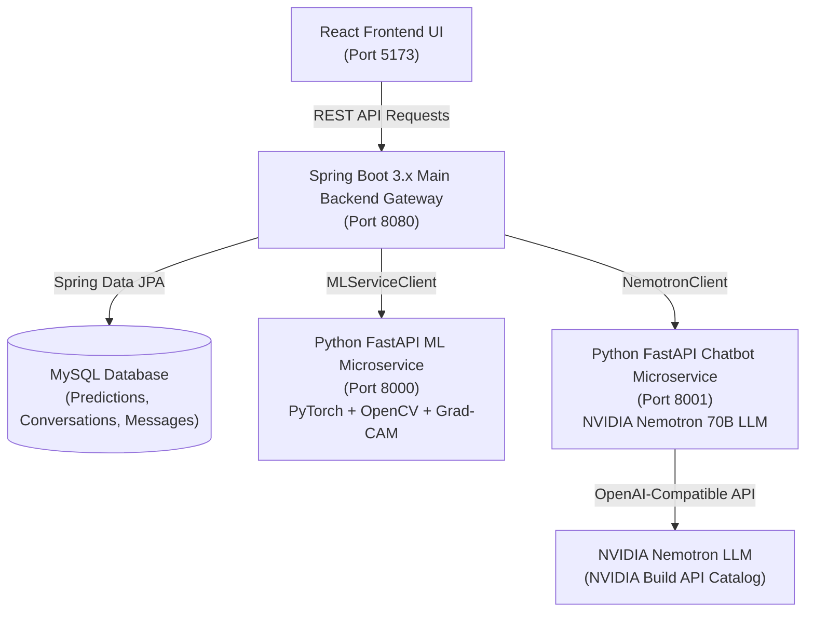

# DermaAI — Enterprise AI Skin Lesion Detection & NVIDIA Nemotron Medical Assistant System

A production-style **Hybrid Microservices Architecture** combining **Spring Boot 3.x**, **Python PyTorch Deep Learning**, **NVIDIA Nemotron 70B AI Chatbot**, **MySQL Persistence**, and **React UI** for 7-class dermoscopic skin lesion classification (`akiec`, `bcc`, `bkl`, `df`, `mel`, `nv`, `vasc`), calibrated confidence scoring, and Grad-CAM visual heatmaps.

---

## 🏛️ Microservices System Architecture



---

## 🌟 Technology Stack & Architecture Components

### 1. Spring Boot 3.x Main Application Gateway (`backend-springboot/`)
- **Technology:** Java 17+, Spring Boot 3.2.3, Spring Web, Spring Data JPA, Hibernate, MySQL, Lombok, OpenAPI 3 (Swagger UI).
- **Responsibilities:** 
  - Primary application gateway for all client API endpoints.
  - Image upload validation and local storage orchestration.
  - Inter-service communication via Spring `RestTemplate` clients (`MLServiceClient`, `NemotronClient`).
  - Prediction & chat conversation persistence using Spring Data JPA.
  - Global Exception Handling (`@RestControllerAdvice`) and Swagger 3 OpenAPI Docs (`/swagger-ui.html`).

### 2. Python PyTorch ML Microservice (`backend/`)
- **Technology:** Python 3.11, FastAPI, PyTorch, OpenCV, Torchvision, Grad-CAM.
- **Responsibilities:**
  - Multi-architecture deep learning models (`EfficientNet-B0`, `ConvNeXt-Tiny`, `ViT-DeiT-Tiny`).
  - OpenCV DullRazor hair removal and CLAHE contrast enhancement.
  - Post-hoc L-BFGS Temperature Calibration for Expected Calibration Error (ECE) minimization (**93.27% ROC-AUC**).
  - Layer-targeted Grad-CAM visual feature heatmap overlays.

### 3. NVIDIA Nemotron AI Chatbot Microservice (`chatbot-service/`)
- **Technology:** Python 3.11, FastAPI, NVIDIA Nemotron LLM API (`nvidia/llama-3.1-nemotron-70b-instruct` / `meta/llama-3.3-70b-instruct`).
- **Responsibilities:**
  - Connects to official NVIDIA Build API Catalog (`https://integrate.api.nvidia.com/v1/chat/completions`).
  - Enforces 10 strict system-level **Medical Safety Guardrails** (non-definitive diagnostic language, dermatologist referral escalation, emergency warning signs).
  - Receives auto-loaded prediction context (Primary Diagnosis, Calibrated Confidence, Top Differential Breakdown, Risk Level).

### 4. MySQL Data Persistence (`mysql`)
- **Database Schema:** `skinlesion_db`
- **Tables:**
  - `predictions`: Persists historical skin lesion scan results, confidence scores, and Grad-CAM heatmaps.
  - `conversations`: Manages user chat session metadata and timestamps.
  - `chat_messages`: Stores message history for context-aware medical assistant sessions.

### 5. React Frontend UI (`frontend/`)
- **Technology:** React, Vite, Axios, Custom CSS.
- **Features:**
  - **Diagnostic Demo:** Upload lesion images, view calibrated confidence meters, risk level badges, and Grad-CAM visual heatmaps.
  - **"Ask AI About This Result 🤖"**: Auto-populates prediction context into the Nemotron Chatbot session.
  - **AI Chatbot Tab:** Interactive medical assistant with quick action prompt chips and medical safety disclaimers.
  - **Prediction History Tab:** Full table of historical scans stored in MySQL with delete and refresh actions.

---

## 📊 Class Mapping & Clinical Risk Matrix

| Code | Medical Name | Category | Risk Level |
|---|---|---|---|
| `akiec` | Actinic Keratoses / Intraepithelial Carcinoma | Pre-cancerous | High Risk |
| `bcc` | Basal Cell Carcinoma | Malignant Cancer | High Risk |
| `bkl` | Benign Keratosis-like Lesions | Benign | Low Risk |
| `df` | Dermatofibroma | Benign | Low Risk |
| `mel` | Melanoma | Malignant Cancer | Critical Risk |
| `nv` | Melanocytic Nevi (Moles) | Benign | Low Risk |
| `vasc` | Vascular Lesions | Benign | Low Risk |

---

## ⚡ Quick Start & Installation

### Option 1: Docker Compose Deployment (Recommended)

To launch the full microservices stack with Docker Compose:

```bash
docker-compose up --build
```

- **React Web Application:** `http://localhost:5173`
- **Spring Boot Swagger 3 API Docs:** `http://localhost:8080/swagger-ui.html`
- **FastAPI ML Service Docs:** `http://localhost:8000/docs`
- **FastAPI Nemotron Chatbot Service Docs:** `http://localhost:8001/docs`

---

### Option 2: Manual Multi-Terminal Startup

#### 1. Python ML Microservice (Port 8000)
```bash
uvicorn app.main:app --host 0.0.0.0 --port 8000 --app-dir backend
```

#### 2. NVIDIA Nemotron Chatbot Microservice (Port 8001)
```bash
python chatbot-service/main.py
```

#### 3. Spring Boot Backend Gateway (Port 8080)
```bash
cd backend-springboot
mvn spring-boot:run
```

#### 4. React Frontend (Port 5173)
```bash
cd frontend
npm install
npm run dev
```
Open `http://localhost:5173` in your browser.

---

## 📋 REST API Endpoints (Spring Boot Gateway)

### Lesion Prediction APIs
- `POST /api/lesions/predict` — Multipart image upload classification + Grad-CAM heatmap generation + MySQL persistence.
- `GET /api/lesions/history` — Retrieves all historical predictions saved in MySQL.
- `GET /api/lesions/{id}` — Fetches a specific prediction record from MySQL.
- `DELETE /api/lesions/{id}` — Deletes a prediction record.

### NVIDIA Nemotron Chatbot APIs
- `POST /api/chat` — Sends prompt + prediction context to NVIDIA Nemotron microservice and saves conversation to MySQL.
- `POST /api/chat/conversations` — Creates a new chat conversation session.
- `GET /api/chat/conversations` — Retrieves all chat conversations.
- `GET /api/chat/conversations/{id}` — Retrieves messages in a specific conversation session.
- `DELETE /api/chat/conversations/{id}` — Deletes a conversation session.

---
