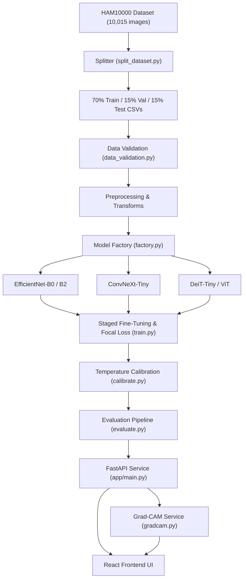

# AI Skin Lesion Detection System & Grad-CAM Explainability Engine

A production-grade, portfolio-level Machine Learning System for 7-class dermoscopic skin lesion classification and explainability on the **HAM10000** dataset (`akiec`, `bcc`, `bkl`, `df`, `mel`, `nv`, `vasc`).

Built with **PyTorch**, **FastAPI**, **React**, **OpenCV**, and **Grad-CAM**.

---

## 🌟 Key Highlights & System Improvements

- **Zero Data Leakage Pipeline:** 70% Train / 15% Val / 15% Test lesion-level stratified split avoiding data contamination.
- **Automated Data Quality Suite (`data_validation.py`):** Pre-training integrity verification detecting MD5 duplicates, corrupt files, missing images, and split leakage.
- **Modular Deep Learning Factory:** Supports transfer learning and comparison across **EfficientNet-B0**, **EfficientNet-B2**, **ConvNeXt-Tiny**, and **DeiT-Tiny / ViT**.
- **Staged Fine-Tuning with Discriminative LRs:** Phase 1 classifier head training followed by Phase 2 backbone unfreezing ($10^{-3}$ head LR, $10^{-5}$ backbone LR).
- **Class Imbalance Handling:** Controlled Focal Loss ($\gamma = 2.0$) and Weighted Cross-Entropy optimization focusing on hard minority samples (`mel`, `bcc`, `akiec`).
- **Post-Hoc Probability Calibration:** L-BFGS Temperature Scaling fitting to minimize Expected Calibration Error (ECE) and produce trustworthy confidence scores.
- **Architecture-Aware Grad-CAM Explainability:** Generates visual feature heatmap overlays highlighting anatomical lesion regions for both CNNs and Vision Transformers.
- **Interactive Medical-AI Interface:** React UI featuring top-3 probability breakdown, risk level badges, low-confidence abstention warnings, and dynamic test metric dashboards.

---

## 📐 System Architecture Diagram



---

## 📊 Class Mapping & Clinical Risk Matrix

| Code | Medical Name | Category | Risk Level |
|---|---|---|---|
| `akiec` | Actinic Keratoses / Intraepithelial Carcinoma | Pre-cancerous | High Risk |
| `bcc` | Basal Cell Carcinoma | Malignant Cancer | High Risk |
| `bkl` | Benign Keratosis-like Lesions | Benign | Low Risk |
| `df` | Dermatofibroma | Benign | Low Risk |
| `mel` | Melanoma | Malignant Cancer | Critical Risk |
| `nv` | Melanocytic Nevi (Moles) | Benign | Low Risk |
| `vasc` | Vascular Lesions | Benign | Low Risk |

---

## ⚡ Quick Start & Installation

### 1. Clone & Install Dependencies
```bash
git clone https://github.com/divyanshh19/AI-skin-disease-detection.git
cd AI-skin-disease-detection
pip install -r backend/requirements.txt
```

### 2. Generate Splits & Validate Data
```bash
python backend/ml/datasets/split_dataset.py --config config.yaml
python backend/ml/data_validation.py --config config.yaml
```

### 3. Model Training & Evaluation
```bash
python backend/ml/training/train.py --config config.yaml --model efficientnet_b0 --loss focal
python backend/ml/calibration/calibrate.py --config config.yaml
python backend/ml/evaluation/evaluate.py --config config.yaml --model efficientnet_b0
python backend/ml/evaluation/error_analysis.py --config config.yaml --model efficientnet_b0
```

### 4. Launch Application Services

#### FastAPI Backend (Port 8000)
```bash
uvicorn app.main:app --reload --host 0.0.0.0 --port 8000 --app-dir backend
```
API Documentation: `http://localhost:8000/docs`

#### React Frontend (Port 5173)
```bash
cd frontend
npm install
npm run dev
```
Open `http://localhost:5173` in your browser.

---

## 🐳 Docker Deployment

To launch the full stack with Docker Compose:

```bash
docker-compose up --build
```
- Frontend: `http://localhost:3000`
- Backend API: `http://localhost:8000`

---

## 📋 API Endpoints

- `POST /api/v1/predict` — Submit an image for calibrated classification.
- `POST /api/v1/predict/explain` — Submit an image for classification + Grad-CAM heatmap overlay.
- `GET /api/v1/health` — System status and loaded model info.
- `GET /api/v1/model-info` — Metadata for active model architecture.
- `GET /api/v1/metrics` — Serves evaluated test metrics dynamically.
- `GET /api/v1/classes` — Diagnostic classes directory.

---

## ⚠️ Medical Disclaimer

**RESEARCH AND EDUCATIONAL PROTOTYPE ONLY.** This application is designed for research, portfolio demonstration, and educational purposes. It does NOT provide clinical medical diagnoses. Always seek the advice of a qualified dermatologist or medical professional for health evaluations.
